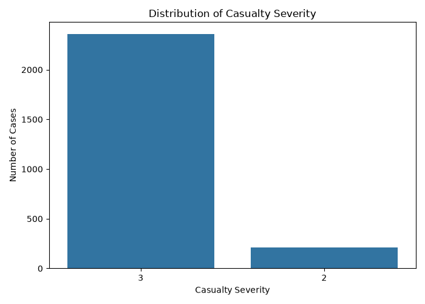
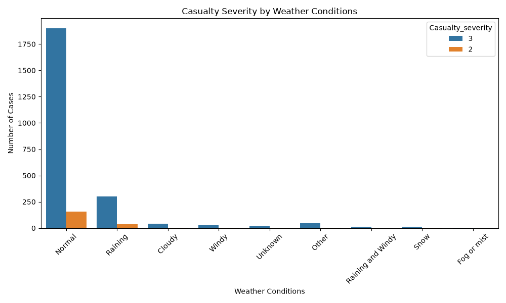
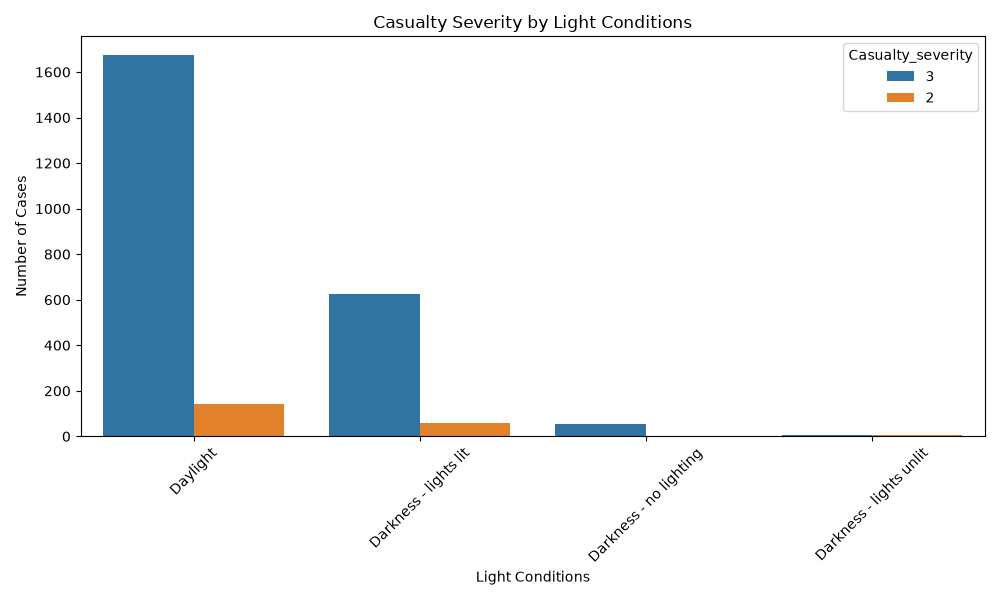
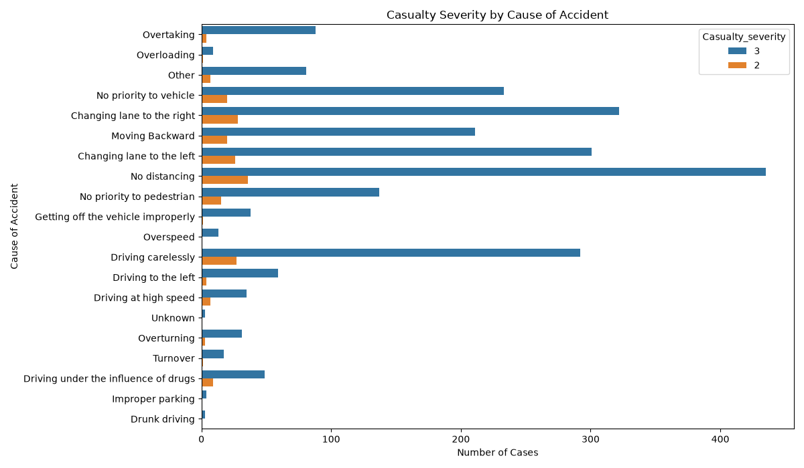
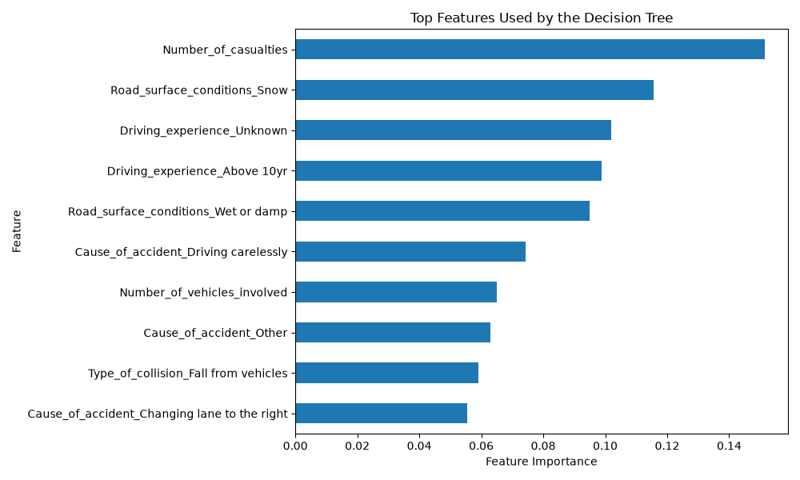

# Road Accident Casualty Severity Prediction

## Project Overview

This project uses machine learning to predict casualty severity in road traffic accidents.

The project explores accident-related factors such as weather conditions, light conditions, road surface conditions, driving experience, collision type, cause of accident, number of vehicles involved, and number of casualties.

A Decision Tree Classifier was used to build the prediction model.

## Dataset

The dataset contains road traffic accident records with information about:

* Driver characteristics
* Road conditions
* Weather and light conditions
* Vehicle information
* Accident causes
* Number of vehicles involved
* Number of casualties
* Casualty severity

After cleaning the data and removing records with unknown casualty severity, 2,570 records were available for analysis.

The dataset used for this project contains only two represented severity classes, so it does not represent all possible severity categories.

## Data Cleaning

The following steps were performed:

1. Removed the `Num` column because it was only an identifier.
2. Replaced missing categorical values with `Unknown`.
3. Removed records where `Casualty_severity` was `na`.
4. Examined the distribution of the remaining severity classes.

## Exploratory Data Analysis

The following visualizations were created:

### Casualty Severity Distribution







## Machine Learning

A Decision Tree Classifier was used for classification.

The following features were selected:

* Weather conditions
* Light conditions
* Road surface conditions
* Driving experience
* Type of collision
* Cause of accident
* Number of vehicles involved
* Number of casualties

Categorical variables were converted into numerical features using one-hot encoding.

The dataset was divided into training and testing sets using an 80/20 split.

## Model Performance

The Decision Tree achieved an overall accuracy of approximately **91.44%** on the test set.

However, the dataset was highly imbalanced. The model performed much better on the majority class than on the minority class.

### Confusion Matrix

```text
[[  1  41]
 [  3 469]]
```

This shows that the model correctly identified most cases belonging to the majority class but struggled to identify the minority class.

Therefore, accuracy alone should not be used to judge the model's performance.

## Feature Importance



The Decision Tree identified the following features among the most influential:

1. Number of casualties
2. Road surface conditions - Snow
3. Driving experience - Unknown

Feature importance indicates which variables the model relied on when making predictions. It does not prove that these factors directly cause accident severity.

## Key Findings

* The dataset contained a strong imbalance between the represented severity classes.
* The Decision Tree achieved high overall accuracy but had poor performance on the minority class.
* Number of casualties was the most influential feature in the model.
* Unknown values can also become influential, highlighting the importance of handling incomplete data carefully.

## Limitations

* The dataset subset used in this project did not contain fatal-severity cases.
* The classes were highly imbalanced.
* The model therefore had difficulty identifying the minority severity class.
* Feature importance shows predictive usefulness, not causation.

## Tools Used

* Python
* Pandas
* Matplotlib
* Seaborn
* Scikit-learn
* Decision Tree Classification

## Conclusion

This project demonstrates a basic machine-learning workflow for road accident casualty severity prediction, including data cleaning, exploratory data analysis, feature selection, model training, evaluation, and interpretation.

The project also demonstrates why model accuracy should be considered alongside other evaluation metrics, especially when working with imbalanced datasets.
